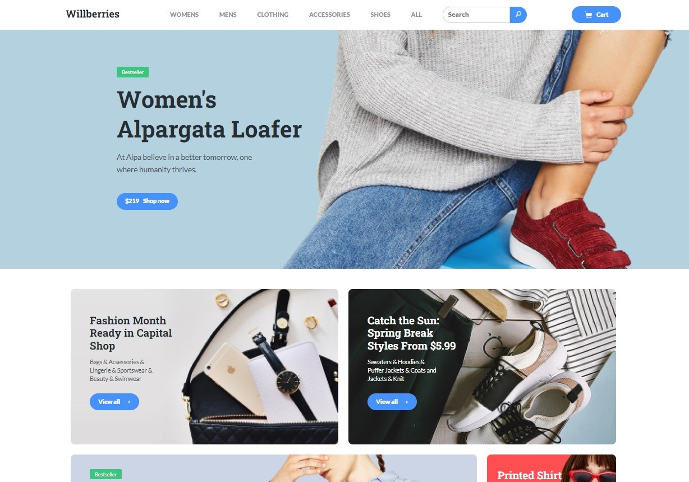

### Wildberries

<strong>Tools:</strong> pure HTML/CSS, vanilla JavaScript, Farebase, fetch API, Bootsrap

Here is an example of a marketplace.

The main page implements the receipt of data from the network, search and sorting by goods.

On the page with product categories you can add and process products in the shopping cart, implemented work with forms, and sending data from the shopping cart to the server.

You can find the code <a href="https://github.com/confesssa/wildberries">here</a>. Deploy is <a href="https://confesssa.github.io/wildberries/index.html">here</a> or you can click on the image below.

